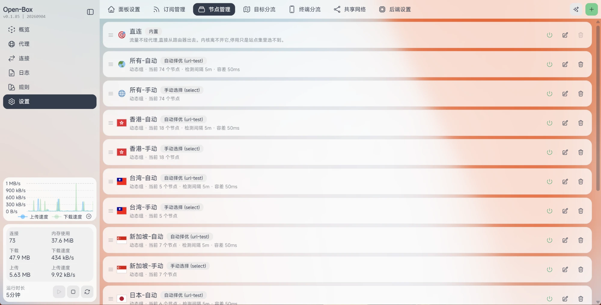
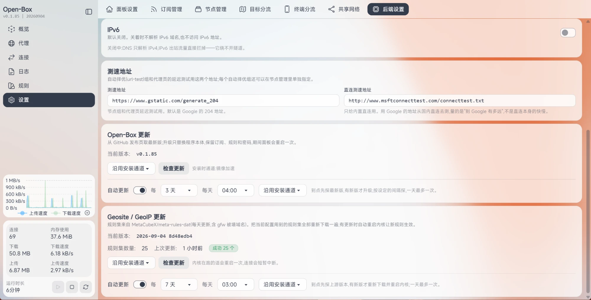

<picture>
  <source media="(prefers-color-scheme: dark)" srcset="docs/pic/logo-dark.png">
  
</picture>

Open-Box 是面向 OpenWrt 路由器的一体化透明代理面板。安装包内置 Open-Box、sing-box 内核、Node 运行时以及 GeoSite / GeoIP 数据，安装后通过浏览器完成订阅、节点、分流、DNS 和防火墙设置，不需要手写配置文件。

## 使用说明视频

[观看 Open-Box 使用说明视频（YouTube）](https://youtu.be/G_7AmjfSRQ8)

## 推荐服务

- 优惠购买 AI 接口、机场、VPS、住宅 IP：[**安格超市**](https://blog.angeworld.cc/market)
- AI 中转站：[**SUPERDOOR 订阅服务**](https://ai.superdoor.top/)
- 按需付费 AI 服务：[**OPENDOOR**](https://ai.opendoor.sbs/)

## 界面

**代理 · 策略**：每个站点集一张卡片，直接看到当前线路和节点健康状态。


**域名穿透**：展开策略后，可以看到站点集、节点组和具体节点的完整链路。


**规则 · 真实路由**：输入域名后可预览规则匹配结果，并实际发起请求查看线路、DNS 和命中规则。


**订阅管理**：支持 Clash YAML、base64 分享链接和常见 sing-box 分享链接；订阅分享区域可展开或收起，分享链接支持二维码、复制和启停。


**出站节点**：自动择优组和手动选择组可以混排，动态组会按关键词自动收编新节点。



**目标分流**：站点集支持域名、域名后缀、关键词、IP 段、规则集和规则集链接等匹配方式。


**后端设置**：IPv6、测速地址、内核服务和组件升级都在这里管理。



## 主要功能

- **订阅与节点**：支持 Clash 配置、base64 节点分享和 shadowsocks、vmess、vless（含 REALITY）、trojan、hysteria2、tuic、anytls、wireguard 等协议。节点命名遵循 Open-Box 的重命名规则：有重命名时使用重命名，没有重命名时保留原名称。
- **节点组**：提供自动择优（url-test）和手动选择（select）组；动态组按关键词跟随订阅更新，静态组可以手工选择节点。
- **目标分流**：规则可以直接填写，也可以添加规则集链接。规则集链接和本地规则明细可以同时保留、同时生效，不会因为导入明细而删除原有链接。
- **规则集导入**：在站点集编辑窗口点击“导入规则”，输入规则列表地址后可以先预览解析结果，再把域名、域名后缀、关键词、IP/CIDR 等明细导入站点集。导入后的明细保存在本地，启动时不再依赖该远程规则链接。
- **订阅分享**：可以选择要分享的节点，设置标题和域名/IP，协议前缀支持 HTTP 或 HTTPS；保存一次即可生成并关闭窗口。分享列表支持展开/收起，单条分享可以启用或停用，也可以复制链接、刷新和删除。
- **DNS 接管**：支持接管 dnsmasq 转发、防火墙劫持和禁用三种模式，国内域名与代理域名可以分别解析。
- **共享网络**：可以把内核入站开放给局域网中的其它设备作为代理使用。
- **流量统计**：按终端设备、节点和访问目标查看每日流量。
- **内置规则数据库**：完整安装包自带 GeoSite / GeoIP 数据，首次安装和启动无需单独下载规则数据库。
- **组件升级**：Open-Box 程序、sing-box 内核和 GeoSite / GeoIP 数据统一从本仓库 Release 获取。升级前会校验本地版本和文件完整性，版本一致且文件正常时不会重复下载。
- **LuCI 兜底页**：面板打不开时，可以从路由器的“服务 → Open-Box”页面启停服务、恢复直连或卸载。

## 下载

请从 [GitHub Releases](https://github.com/liandu2024/Open-Box/releases/latest) 下载对应架构的完整安装包：

- `x64`：x86_64 路由器
- `arm64`：aarch64 路由器

完整安装包包含 Open-Box、sing-box、Node 运行时和全部 GeoSite / GeoIP 数据。每个资产旁边都有 SHA256 校验文件。

## 安装

SSH 以 root 登录 OpenWrt 路由器后执行：

```sh
curl -fsSL https://raw.githubusercontent.com/liandu2024/Open-Box/main/scripts/install.sh | sh
```

GitHub 访问不畅时，可使用安装脚本支持的镜像参数：

```sh
curl -fsSL https://raw.githubusercontent.com/liandu2024/Open-Box/main/scripts/install.sh | sh -s -- --mirror
```

安装要求：OpenWrt、x86_64 或 aarch64、至少 512MB 存储空间和 512MB 内存。安装完成后，用浏览器打开脚本提示的 `http://<路由器局域网 IP>:2026` 地址，首次访问设置管理密码。

## 升级

面板中可以从“设置 → 后端设置”检查更新，也可以通过 SSH 执行：

```sh
curl -fsSL https://raw.githubusercontent.com/liandu2024/Open-Box/main/scripts/update.sh | sh
```

升级会保留订阅、规则和面板密码，并校验 Open-Box、sing-box、GeoSite / GeoIP 组件。相同且完整的组件直接复用，只有变化、缺失或损坏的组件才会从本仓库 Release 下载。

## 卸载

默认停止服务并保留订阅和配置数据：

```sh
curl -fsSL https://raw.githubusercontent.com/liandu2024/Open-Box/main/scripts/uninstall.sh | sh
```

连数据一起删除：

```sh
curl -fsSL https://raw.githubusercontent.com/liandu2024/Open-Box/main/scripts/uninstall.sh | sh -s -- --purge
```

## 许可证

本仓库公开安装、升级和卸载所需脚本、界面说明图片及发布资产。面板和内核的许可证与版权信息随安装包提供。
